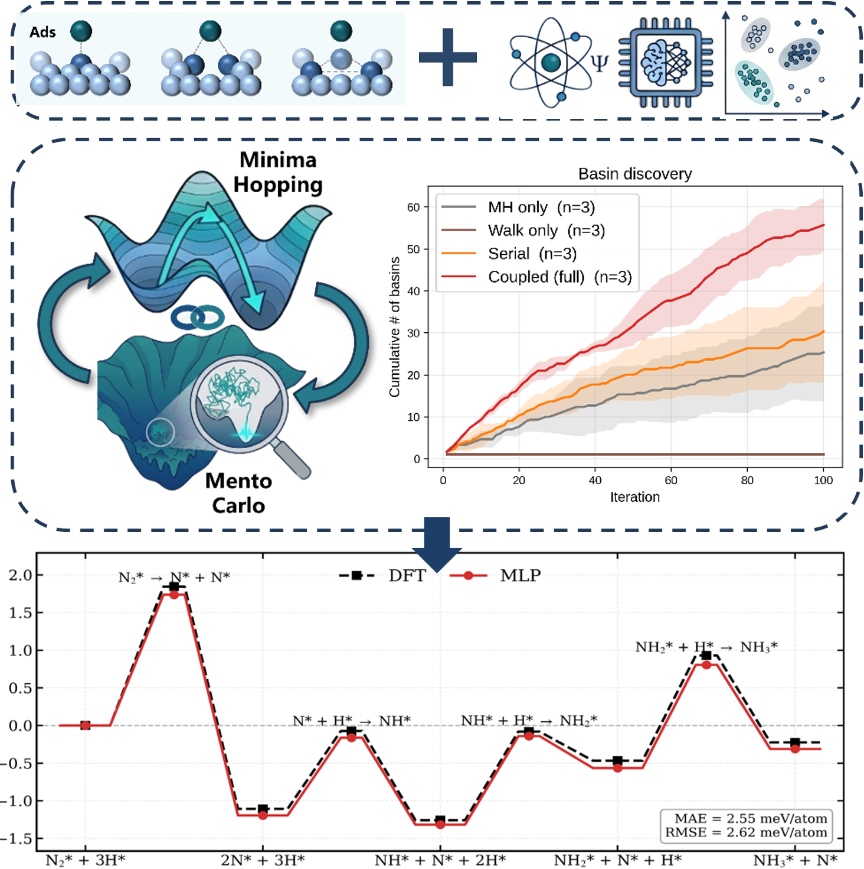

# MHMC-AL-PES Reproducibility Materials



This repository contains reproducibility materials for the manuscript:

**Coupled Minima Hopping and Monte Carlo with Active Learning for Global Sampling of Potential Energy Surfaces**

This repository is prepared as the public **Data and Software Availability** repository for the manuscript. It is intended to support manuscript review, result checking, and reuse of the nonrestricted materials. It is **not** a full public software release of the authors' in-house coupled MH--MC production code. The production implementation is under active development for a future software release.

## Scope of this repository

The manuscript workflow has four main computational layers:

1. **Geometry-aware dual-channel initialization** for generating unbiased initial coadsorption structures.
2. **Coupled MH--MC sampling** for broad basin discovery and local basin-confined enrichment.
3. **Diversity-driven active learning** using SOAP descriptors, kernel PCA, and stratified farthest-point sampling.
4. **MLIP training and validation**, using **NequIP** as the production machine-learning interatomic potential backbone in the manuscript.

This repository provides machine-readable structures, sanitized configuration templates, analysis scripts, plotting scripts, reference implementations for selected non-sensitive modules, pseudocode-level workflow documentation, lightweight and full validation examples available to the authors for this release, and notes on license-restricted files. The full production coupled MH--MC sampler remains in-house pending future software release, but the manuscript and `method_pseudocode/` directory document the algorithmic procedure, hyperparameters, and input/output definitions.

## Repository layout

```text
MHMC-AL-PES-reproducibility/
  README.md
  DATA_AND_SOFTWARE_AVAILABILITY.txt
  CITATION.cff
  LICENSE_NOTICE.md
  FILE_MANIFEST.md
  environment.yml

  data/
    structures/
      initialization/        Fe(110) slab and representative initialized structures
      selected_sets/         Example selected/checking structures
      validation_sets/       Validation structures in extxyz format
    figure_data/             Figure outputs and location for manuscript source data tables

  configs/                   Sanitized templates for Fe--N--H, AL loops, and ablation tests

  scripts/
    initialization_reference/ Reference code for Delaunay sites, grid sampling, and small dual-channel examples
    selection_reference/      Reference implementation of SOAP/KPCA/FPS diversity selection
    analysis/                 Coverage, validation, holdout assembly, and ablation-analysis scripts
    plotting/                 Manuscript-style plotting scripts

  method_pseudocode/          Pseudocode descriptions of the unpublished production workflow
  models_optional/            Notes on optional NequIP model-file distribution
  docs/                       TOC graphic, release notes, VASP notes, and reproducibility guidance
```

The structural data are provided in `extxyz` format and are intended to be machine-readable by ASE and related atomistic-simulation tools.

## What code is included, and what remains in-house

### Included as public reference code

- `scripts/initialization_reference/` contains a cleaned reference implementation of the **dual-channel initialization building blocks**: Delaunay-based top/bridge/hollow site detection, Z-biased near-surface grid sampling, simple clash filtering, and duplicate removal. This is included so that readers can inspect and test the initialization idea without exposing the full production code base.
- `scripts/selection_reference/` contains the SOAP/KPCA/FPS-based diversity-selection module. This part is intentionally architecture-agnostic and can be used with NequIP, MACE, SchNet, or other MLIP backbones.
- `scripts/analysis/` and `scripts/plotting/` contain scripts used to analyze validation, ablation, coverage, and figure-generation data.

### Not included as full public source code at this stage

- The full production **coupled MH--MC sampler** is not distributed in this repository. This includes production-level propagation control, basin database management, escape/walk orchestration, feedback scheduling, job management, restart handling, and internal interfaces to DFT/MLIP engines.
- Full production active-learning orchestration code that launches and manages VASP calculations is not included. Representative settings, pseudocode, and templates are provided instead.
- License-restricted VASP files, especially `POTCAR`, are not redistributed.

This separation is intentional: the repository supports manuscript reproducibility while preserving the unpublished in-house implementation that is being prepared for future software release.

## NequIP usage in this manuscript

The production MLIP backbone used in the manuscript is **NequIP**. The repository includes sanitized configuration templates and metadata describing where NequIP training and evaluation configuration files should be placed. NequIP itself should be installed following its official documentation.

The active-learning selection code is independent of the MLIP architecture, but the reported production potentials and validation metrics in the manuscript were obtained with NequIP models trained on the selected DFT-labeled structures. A compiled NequIP model file may be placed in `models_optional/` only if all authors approve public distribution.

## Reproducing the main analyses

### 1. Install the basic Python environment

A minimal environment is described in `environment.yml`. The analysis and reference scripts mainly require Python, NumPy, SciPy, pandas, scikit-learn, matplotlib, ASE, and dscribe. NequIP and VASP are only required for retraining models or re-running production calculations.

```bash
conda env create -f environment.yml
conda activate mhmc-al-pes-repro
```

### 2. Inspect the structure datasets

```bash
python - <<'PY'
from ase.io import read
for path in [
    'data/structures/initialization/Fe110_slab.extxyz',
    'data/structures/initialization/init_Fe110_4H2N_n100.extxyz',
    'data/structures/validation_sets/HNNH_valid_combined.extxyz',
    'data/structures/validation_sets/valid_combined.extxyz',
]:
    atoms = read(path, ':')
    print(path, len(atoms))
PY
```

### 3. Run the dual-channel initialization reference example

```bash
python scripts/initialization_reference/example_run_initialization.py
```

This example reads the Fe(110) slab, generates a few simple H/H/N coadsorption initial structures, and writes them to `data/structures/initialization/example_generated_HHN.extxyz`. It is a compact public reference example, not the full production initialization workflow.

### 4. Run analysis and plotting scripts

The scripts are provided as manuscript-analysis references. Before running them, check the command-line options and point them to local copies of the CSV/structure files required for each figure.

Example:

```bash
python scripts/plotting/plot_layerB_combined.py \
  --ablation-root data/figure_data/ablation_results_Hookean \
  --seed-summary-csv data/figure_data/seed_metrics_summary.csv \
  --group-summary-csv data/figure_data/group_metrics_summary.csv \
  --coverage-csv data/figure_data/coverage_metric.csv \
  --out data/figure_data/layerB_combined_reproduced.png
```

Some figure-generation scripts require CSV files generated from the authors' internal production workflow. When preparing the public repository, place the corresponding machine-readable source tables in `data/figure_data/` and update `FILE_MANIFEST.md`.

## VASP and pseudopotential note

This repository does not include VASP pseudopotential files. Users should supply their own licensed VASP pseudopotential library and update the placeholder

```text
<PATH_TO_LICENSED_VASP_POTCAR_LIBRARY>
```

in the configuration templates as appropriate.

## License and access note

The files are provided as reproducibility materials for the associated manuscript. Unless a formal open-source license is added by the authors, no license is granted for redistribution or reuse of the unpublished in-house coupled MH--MC production implementation. Access to the in-house implementation for academic evaluation may be arranged through the corresponding authors subject to institutional and licensing restrictions.

## Recommended citation

If you use these materials, please cite the associated manuscript. The final citation can be added here after publication.

## Contact

For questions regarding the manuscript or access to the in-house implementation for academic evaluation, please contact the corresponding authors listed in the manuscript.
